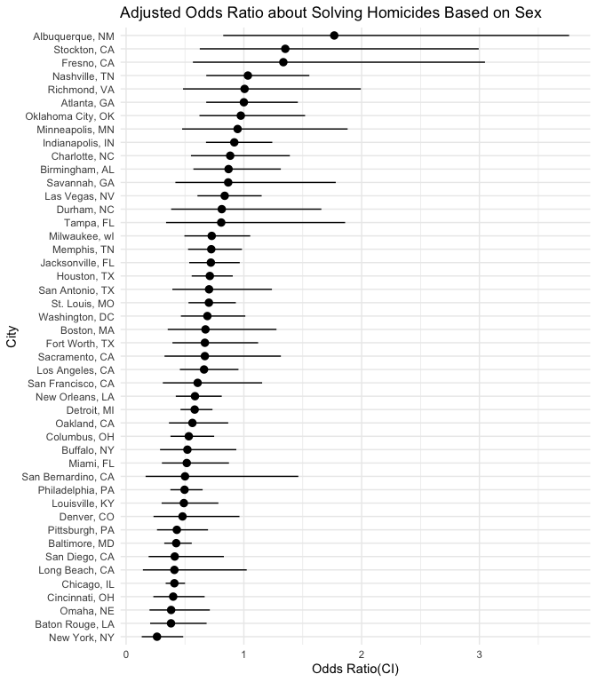
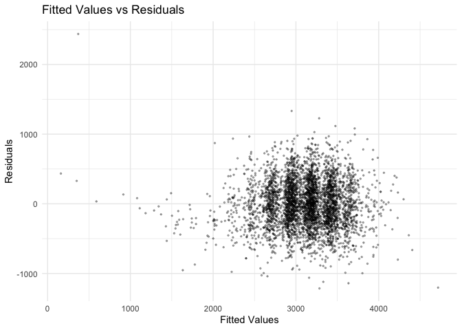
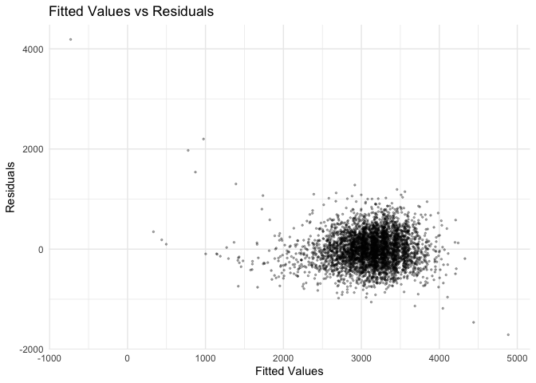
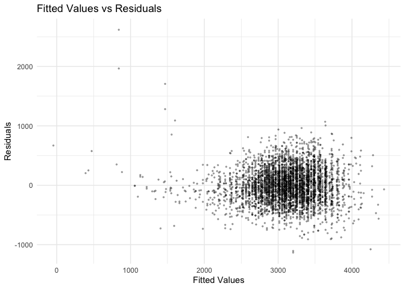
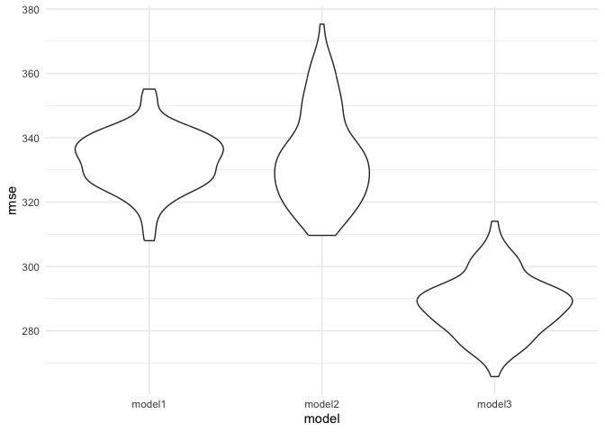

p8105_hw6_hn2453
================

``` r
library(p8105.datasets)
library(dplyr)
```

    ## 
    ## Attaching package: 'dplyr'

    ## The following objects are masked from 'package:stats':
    ## 
    ##     filter, lag

    ## The following objects are masked from 'package:base':
    ## 
    ##     intersect, setdiff, setequal, union

``` r
library(modelr)
library(tidyr)
library(purrr)
library(ggplot2)
library(tidyverse)
```

    ## ── Attaching core tidyverse packages ──────────────────────── tidyverse 2.0.0 ──
    ## ✔ forcats   1.0.0     ✔ stringr   1.5.1
    ## ✔ lubridate 1.9.3     ✔ tibble    3.2.1
    ## ✔ readr     2.1.5

    ## ── Conflicts ────────────────────────────────────────── tidyverse_conflicts() ──
    ## ✖ dplyr::filter() masks stats::filter()
    ## ✖ dplyr::lag()    masks stats::lag()
    ## ℹ Use the conflicted package (<http://conflicted.r-lib.org/>) to force all conflicts to become errors

``` r
library(forcats)
set.seed(1)
```

## problem 1

Import data

``` r
weather_df = 
  rnoaa::meteo_pull_monitors(
    c("USW00094728"),
    var = c("PRCP", "TMIN", "TMAX"), 
    date_min = "2017-01-01",
    date_max = "2017-12-31") %>%
  mutate(
    name = recode(id, USW00094728 = "CentralPark_NY"),
    tmin = tmin / 10,
    tmax = tmax / 10) %>%
  select(name, id, everything())
```

    ## using cached file: /Users/zj/Library/Caches/org.R-project.R/R/rnoaa/noaa_ghcnd/USW00094728.dly

    ## date created (size, mb): 2024-09-26 10:19:26.472753 (8.651)

    ## file min/max dates: 1869-01-01 / 2024-09-30

Draw 5000 bootstrap samples and compute lof of product of beta0 and
beta1.

``` r
boot_1 = 
  weather_df |> 
  modelr::bootstrap(n = 5000)

boot_product = boot_1|>
  mutate(
    models = map(strap,\(df)lm(tmax~tmin,data = df)),
    results = map(models, broom::tidy)
  )|>
  select(-strap,-models)|>
  unnest(results)|>
  mutate(
    log_product = ifelse(term=="(Intercept)",NA,log(estimate[term=="(Intercept)"]*estimate))
  )
```

compute the square of r

``` r
boot_r_square = boot_1|>
  mutate(
    models = map(strap,\(df)lm(tmax~tmin,data = df)),
    results = map(models, broom::glance)
  )|>
  select(-strap,-models)|>
  unnest(results)|>
  mutate( r_square = r.squared)
```

Plot the distribution of estimates

``` r
ggplot(boot_product, aes(x=log_product))+
  geom_density()+
  labs(title = "Distribution of log of product of beta0 and beta1")+
  theme_minimal()
```

    ## Warning: Removed 5000 rows containing non-finite outside the scale range
    ## (`stat_density()`).

<!-- -->

``` r
ggplot(boot_r_square, aes(x=r_square))+
  geom_density()+
  labs(title = "Distribution of r square")+
  theme_minimal()
```

<!-- -->

calculate 95% confidence interval

``` r
CI_r_square = quantile(boot_r_square$r_square,c(0.025,0.975))
CI_r_square
```

    ##      2.5%     97.5% 
    ## 0.8936684 0.9271060

``` r
CI_product = quantile(boot_product$log_product,c(0.025,0.975),na.rm=TRUE)
CI_product
```

    ##     2.5%    97.5% 
    ## 1.935801 2.089389

## problem 2

import data, clean and arrange these data.

``` r
homicide = read_csv("data/homicide-data.csv") |>
  janitor::clean_names()|>
  mutate(city_state = paste(city, state, sep = ", "))|>
  mutate(resolved = as.numeric(disposition=="Closed by arrest"))|>
  filter(!city %in% c("Dallas","Phoenix","Kansas City","Tulsa"))|>
  filter(victim_race %in% c("White","Black"))|>
  mutate(victim_age = as.numeric(victim_age))
```

    ## Rows: 52179 Columns: 12
    ## ── Column specification ────────────────────────────────────────────────────────
    ## Delimiter: ","
    ## chr (9): uid, victim_last, victim_first, victim_race, victim_age, victim_sex...
    ## dbl (3): reported_date, lat, lon
    ## 
    ## ℹ Use `spec()` to retrieve the full column specification for this data.
    ## ℹ Specify the column types or set `show_col_types = FALSE` to quiet this message.

    ## Warning: There was 1 warning in `mutate()`.
    ## ℹ In argument: `victim_age = as.numeric(victim_age)`.
    ## Caused by warning:
    ## ! NAs introduced by coercion

analyze the condition in Baltimore

``` r
baltimore = homicide |>
  filter(city_state=="Baltimore, MD")
  
  
baltimore_ml = glm(resolved ~ victim_age+victim_sex+victim_race, family = binomial(), data = baltimore)
```

fit a logistic regression and obtain the estimate and confidence
interval of odds ratio

``` r
baltimore_ml |>
  broom:: tidy(conf.int = TRUE)|>
  filter(term=="victim_sexMale")|>
  mutate(OR=exp(estimate),
         exp_conf_low = exp(conf.low),
         exp_conf_high = exp(conf.high))
```

    ## # A tibble: 1 × 10
    ##   term           estimate std.error statistic  p.value conf.low conf.high    OR
    ##   <chr>             <dbl>     <dbl>     <dbl>    <dbl>    <dbl>     <dbl> <dbl>
    ## 1 victim_sexMale   -0.854     0.138     -6.18 6.26e-10    -1.13    -0.584 0.426
    ## # ℹ 2 more variables: exp_conf_low <dbl>, exp_conf_high <dbl>

run glm for each of the cities like baltimore

``` r
citys_ml = homicide|>
  group_by(city_state)|>
  nest()|>
  mutate(
    models = map(data,\(df) glm(resolved ~ victim_age + victim_sex + victim_race, family = binomial,data = df)),
    results = map(models, broom::tidy, conf.int = TRUE)
  )|>
  select(-data,-models)|>
  unnest(results)|>
  filter(term == "victim_sexMale")|>
  mutate(
    OR=exp(estimate),
    exp_conf_low = exp(conf.low),
    exp_conf_high = exp(conf.high)
  )
```

    ## Warning: There were 44 warnings in `mutate()`.
    ## The first warning was:
    ## ℹ In argument: `results = map(models, broom::tidy, conf.int = TRUE)`.
    ## ℹ In group 1: `city_state = "Albuquerque, NM"`.
    ## Caused by warning:
    ## ! glm.fit: fitted probabilities numerically 0 or 1 occurred
    ## ℹ Run `dplyr::last_dplyr_warnings()` to see the 43 remaining warnings.

``` r
citys_ml
```

    ## # A tibble: 46 × 11
    ## # Groups:   city_state [46]
    ##    city_state     term  estimate std.error statistic  p.value conf.low conf.high
    ##    <chr>          <chr>    <dbl>     <dbl>     <dbl>    <dbl>    <dbl>     <dbl>
    ##  1 Albuquerque, … vict…  5.70e-1     0.385  1.48     1.39e- 1   -0.193    1.32  
    ##  2 Atlanta, GA    vict…  7.71e-5     0.194  0.000397 1.00e+ 0   -0.385    0.377 
    ##  3 Baltimore, MD  vict… -8.54e-1     0.138 -6.18     6.26e-10   -1.13    -0.584 
    ##  4 Baton Rouge, … vict… -9.64e-1     0.306 -3.15     1.65e- 3   -1.59    -0.380 
    ##  5 Birmingham, AL vict… -1.39e-1     0.212 -0.657    5.11e- 1   -0.560    0.273 
    ##  6 Boston, MA     vict… -3.95e-1     0.326 -1.21     2.26e- 1   -1.04     0.244 
    ##  7 Buffalo, NY    vict… -6.53e-1     0.299 -2.18     2.90e- 2   -1.24    -0.0663
    ##  8 Charlotte, NC  vict… -1.23e-1     0.236 -0.524    6.00e- 1   -0.596    0.330 
    ##  9 Chicago, IL    vict… -8.91e-1     0.102 -8.77     1.86e-18   -1.09    -0.691 
    ## 10 Cincinnati, OH vict… -9.17e-1     0.269 -3.41     6.49e- 4   -1.46    -0.405 
    ## # ℹ 36 more rows
    ## # ℹ 3 more variables: OR <dbl>, exp_conf_low <dbl>, exp_conf_high <dbl>

create plot for citys_ml

``` r
ggplot(citys_ml, aes(x=reorder(city_state, OR), y = OR, ymin = exp_conf_low,ymax=exp_conf_high))+
  geom_pointrange()+
  coord_flip()+
  labs(title = "Adjusted Odds Ratio about Solving Homicides Based on Sex",
       x="City",
       y = "Odds Ratio(CI)")+
  theme_minimal()
```

<!-- -->
From the plot, we can get that only about 6 cities’ odds ratio are
larger than 1, and mostly cities’ odds ratio are less than 1. Thus, in
most cities, male victims are associated with lower odds of the homicide
being solved compared to female victims.

## problem 3

import data and clean it

``` r
birth = read_csv("data/birthweight.csv")|>
  janitor::clean_names()|>
  drop_na()|>
  mutate(
    babysex = factor(babysex, levels = c(1, 2), labels = c("Male", "Female")),
    frace = factor(frace, levels = c(1, 2, 3, 4, 8, 9), labels = c("White", "Black", "Asian", "Puerto Rican", "Other", "Unknown")),
    mrace = factor(mrace, levels = c(1, 2, 3, 4, 8), labels = c("White", "Black", "Asian", "Puerto Rican", "Other")),
    malform = factor(malform, levels = c(0, 1), labels = c("Absent", "Present"))
  )
```

    ## Rows: 4342 Columns: 20
    ## ── Column specification ────────────────────────────────────────────────────────
    ## Delimiter: ","
    ## dbl (20): babysex, bhead, blength, bwt, delwt, fincome, frace, gaweeks, malf...
    ## 
    ## ℹ Use `spec()` to retrieve the full column specification for this data.
    ## ℹ Specify the column types or set `show_col_types = FALSE` to quiet this message.

fit a linear regresson model with predictors of bhead, delwt, momage.

``` r
ml_1 = lm(bwt~bhead+delwt+momage, data = birth)
summary(ml_1)
```

    ## 
    ## Call:
    ## lm(formula = bwt ~ bhead + delwt + momage, data = birth)
    ## 
    ## Residuals:
    ##      Min       1Q   Median       3Q      Max 
    ## -1214.15  -224.67    -8.55   219.87  2437.28 
    ## 
    ## Coefficients:
    ##               Estimate Std. Error t value Pr(>|t|)    
    ## (Intercept) -5047.2205   106.6322 -47.333  < 2e-16 ***
    ## bhead         225.5445     3.2070  70.328  < 2e-16 ***
    ## delwt           3.0275     0.2333  12.977  < 2e-16 ***
    ## momage          6.4607     1.3127   4.922 8.89e-07 ***
    ## ---
    ## Signif. codes:  0 '***' 0.001 '**' 0.01 '*' 0.05 '.' 0.1 ' ' 1
    ## 
    ## Residual standard error: 333 on 4338 degrees of freedom
    ## Multiple R-squared:  0.5776, Adjusted R-squared:  0.5773 
    ## F-statistic:  1978 on 3 and 4338 DF,  p-value: < 2.2e-16

All four p-value is less than 0.5, showing that baby’s head, mother’s
weight, and mother’s age is significantly positive related with baby’s
weight.

plot model residual against fitted values

``` r
birth = birth |>
  add_predictions(ml_1,var = "predict_bwt")|>
  add_residuals(ml_1,var = "residuals")

ggplot(birth, aes(x=predict_bwt,y=residuals))+
  geom_point(alpha = 0.3, size = 0.5)+
  labs(title = "Fitted Values vs Residuals",
       x= "Fitted Values",
       y = "Residuals")+
  theme_minimal()
```

<!-- -->
create and plot second model

``` r
ml_2 <- lm(bwt ~ blength + gaweeks, data = birth)

birth = birth |>
  add_predictions(ml_2,var = "predict_bwt_2")|>
  add_residuals(ml_2,var = "residuals_2")

ggplot(birth, aes(x=predict_bwt_2,y=residuals_2))+
  geom_point(alpha = 0.3, size = 0.5)+
  labs(title = "Fitted Values vs Residuals",
       x= "Fitted Values",
       y = "Residuals")+
  theme_minimal()
```

<!-- -->
create and plot third model

``` r
ml_3 <- lm(bwt ~ bhead + blength +babysex+bhead:blength+bhead:babysex+blength:babysex+bhead:blength:babysex, data = birth)

birth = birth |>
  add_predictions(ml_3,var = "predict_bwt_3")|>
  add_residuals(ml_3,var = "residuals_3")

ggplot(birth, aes(x=predict_bwt_3,y=residuals_3))+
  geom_point(alpha = 0.3, size = 0.5)+
  labs(title = "Fitted Values vs Residuals",
       x= "Fitted Values",
       y = "Residuals")+
  theme_minimal()
```

<!-- -->

``` r
cv_df = crossv_mc(birth,100)|>
  mutate(
    train= map(train,as_tibble),
    test = map(test,as_tibble)
  )

cv_df = cv_df|>
  mutate(
    model_2 = map(train, \(df) lm(bwt ~ blength + gaweeks, data = birth)),
    model_1 = map(train, \(df) lm(bwt~bhead+delwt+momage, data = birth)),
    model_3 = map(train, \(df) lm(bwt ~ bhead + blength +babysex+bhead:blength+bhead:babysex+blength:babysex+bhead:blength:babysex, data = birth)),
  )|>
  mutate(
    rmse_model1 = map2_dbl(model_1, test, \(mod, df) rmse(model = mod, data = df)),
    rmse_model2 = map2_dbl(model_2, test, \(mod, df) rmse(model = mod, data = df)),
    rmse_model3 = map2_dbl(model_3, test, \(mod, df) rmse(model = mod, data = df)),
  )
```

``` r
cv_df |> 
  select(starts_with("rmse")) |> 
  pivot_longer(
    everything(),
    names_to = "model", 
    values_to = "rmse",
    names_prefix = "rmse_"
  ) |> 
mutate(model = fct_inorder(model)) |> 
  ggplot(aes(x = model, y = rmse)) +
  geom_violin()+
  theme_minimal()
```

<!-- -->
