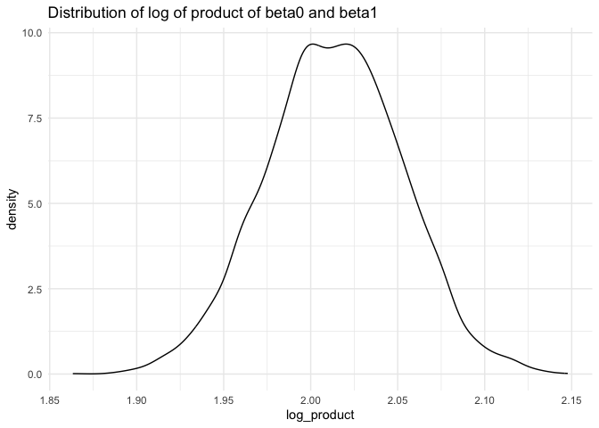
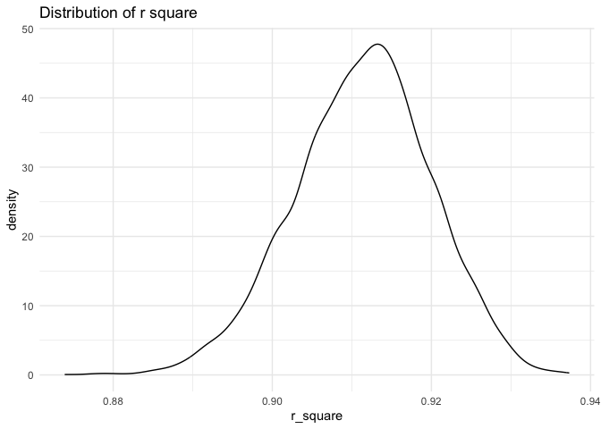

p8105_hw6_hn2453
================

``` r
library(p8105.datasets)
library(dplyr)
```

    ## 
    ## Attaching package: 'dplyr'

    ## The following objects are masked from 'package:stats':
    ## 
    ##     filter, lag

    ## The following objects are masked from 'package:base':
    ## 
    ##     intersect, setdiff, setequal, union

``` r
library(modelr)
library(tidyr)
library(purrr)
library(ggplot2)
set.seed(1)
```

## problem 1

Import data

``` r
weather_df = 
  rnoaa::meteo_pull_monitors(
    c("USW00094728"),
    var = c("PRCP", "TMIN", "TMAX"), 
    date_min = "2017-01-01",
    date_max = "2017-12-31") %>%
  mutate(
    name = recode(id, USW00094728 = "CentralPark_NY"),
    tmin = tmin / 10,
    tmax = tmax / 10) %>%
  select(name, id, everything())
```

    ## using cached file: /Users/zj/Library/Caches/org.R-project.R/R/rnoaa/noaa_ghcnd/USW00094728.dly

    ## date created (size, mb): 2024-09-26 10:19:26.472753 (8.651)

    ## file min/max dates: 1869-01-01 / 2024-09-30

Draw 5000 bootstrap samples and compute lof of product of beta0 and
beta1.

``` r
boot_1 = 
  weather_df |> 
  modelr::bootstrap(n = 5000)

boot_product = boot_1|>
  mutate(
    models = map(strap,\(df)lm(tmax~tmin,data = df)),
    results = map(models, broom::tidy)
  )|>
  select(-strap,-models)|>
  unnest(results)|>
  mutate(
    log_product = ifelse(term=="(Intercept)",NA,log(estimate[term=="(Intercept)"]*estimate))
  )
```

compute the square of r

``` r
boot_r_square = boot_1|>
  mutate(
    models = map(strap,\(df)lm(tmax~tmin,data = df)),
    results = map(models, broom::glance)
  )|>
  select(-strap,-models)|>
  unnest(results)|>
  mutate( r_square = r.squared)
```

Plot the distribution of estimates

``` r
ggplot(boot_product, aes(x=log_product))+
  geom_density()+
  labs(title = "Distribution of log of product of beta0 and beta1")+
  theme_minimal()
```

    ## Warning: Removed 5000 rows containing non-finite outside the scale range
    ## (`stat_density()`).

<!-- -->

``` r
ggplot(boot_r_square, aes(x=r_square))+
  geom_density()+
  labs(title = "Distribution of r square")+
  theme_minimal()
```

<!-- -->

calculate 95% confidence interval

``` r
CI_r_square = quantile(boot_r_square$r_square,c(0.025,0.975))
CI_r_square
```

    ##      2.5%     97.5% 
    ## 0.8936684 0.9271060

``` r
CI_product = quantile(boot_product$log_product,c(0.025,0.975),na.rm=TRUE)
CI_product
```

    ##     2.5%    97.5% 
    ## 1.935801 2.089389
